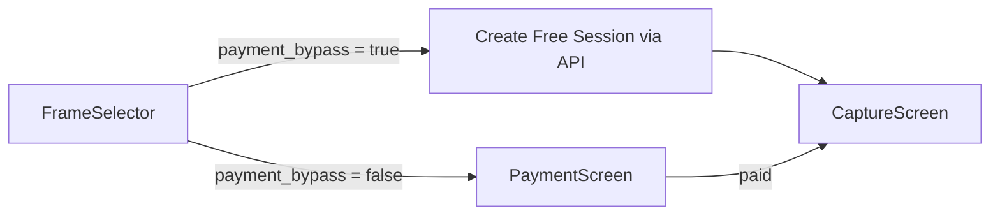

# Feature: Bypassed Payment (Toggle Payment On/Off)

> **Author**: Senior Software Engineer  
> **Date**: 2026-02-22  
> **Status**: Implementation Plan  

## 1. Overview

Add a toggle to allow booth operators to **bypass payment entirely**, so customers can use the photobooth without being redirected to the Xendit payment screen. When bypassed, the flow skips directly from frame selection to photo capture. The bypass state is persisted per-booth in the database so it survives app restarts.

### Current Flow
```
Idle → Voucher → Select Frame → Payment (Xendit QR) → Capturing → Review
```

### Bypassed Flow
```
Idle → Voucher → Select Frame → [SKIP PAYMENT] → Capturing → Review
```

---

## 2. Architecture Overview



The bypass setting is stored as a boolean column `payment_bypass` on the `booths` table in Supabase. The value is:
- Fetched at booth login and stored in `tenant-store` (Booth object)
- Checked in `FrameSelector.handleConfirm()` to decide the next step
- Toggleable from the booth's admin/settings panel

---

## 3. Proposed Changes

### 3.1 Database Schema

#### [MODIFY] Supabase `booths` table
Add a new column `payment_bypass` (boolean, default `false`):

```sql
ALTER TABLE booths ADD COLUMN IF NOT EXISTS payment_bypass boolean DEFAULT false;
```

> [!IMPORTANT]
> Run this migration on Supabase **before** deploying the code changes. The column defaults to `false` so all existing booths will continue requiring payment.

---

### 3.2 Backend (API Routes)

#### [MODIFY] [supabase.ts](file:///Users/christinaindahsetiyorini/Documents/Eagleies%20Creative/chronoapp/src/lib/supabase.ts)

Update the `Booth` interface to include the new field:

```diff
 export interface Booth {
   id: string;
   organization_id: string;
   name: string;
   location: string;
   booth_id: string;
   booth_code: string;
   price: number;
   status: 'active' | 'inactive';
   background_image?: string;
   background_color?: string;
+  payment_bypass?: boolean;
   created_at: string;
   updated_at: string;
 }
```

#### [MODIFY] [route.ts](file:///Users/christinaindahsetiyorini/Documents/Eagleies%20Creative/chronoapp/src/app/api/booth/settings/route.ts) (booth settings)

1. **PATCH handler**: Accept `payment_bypass` in the request body and persist it to the database.
2. **GET handler**: Include `payment_bypass` in the returned settings object.

```diff
 // PATCH handler
 const { error } = await supabase
   .from('booths')
   .update({
     background_image: background_image,
     background_color: background_color,
+    payment_bypass: body.payment_bypass,
     updated_at: new Date().toISOString(),
   })
   .eq('id', booth_id);

 // GET handler
 const { data, error } = await supabase
   .from('booths')
-  .select('background_image, background_color')
+  .select('background_image, background_color, payment_bypass')
   .eq('id', booth.booth_id)
   .single();
```

#### [MODIFY] [route.ts](file:///Users/christinaindahsetiyorini/Documents/Eagleies%20Creative/chronoapp/src/app/api/payment/create/route.ts) (payment create)

Add a check at the top of the POST handler: if the booth has `payment_bypass: true`, create a session immediately with status `paid` (or `capturing`) and return `isFree: true` without creating a Xendit invoice:

```typescript
// After fetching booth...
if (booth.payment_bypass) {
    const session = await createSession(frameId, booth.id);
    return NextResponse.json({
        success: true,
        sessionId: session.id,
        paymentId: null,
        invoiceId: null,
        invoiceUrl: null,
        expiryDate: null,
        amount: 0,
        originalAmount: booth.price,
        discountAmount: booth.price,
        appliedVoucher: null,
        isFree: true,
        isBypassed: true,
    });
}
```

---

### 3.3 Frontend (Booth Kiosk)

#### [MODIFY] [FrameSelector.tsx](file:///Users/christinaindahsetiyorini/Documents/Eagleies%20Creative/chronoapp/src/components/booth/FrameSelector.tsx)

Update `handleConfirm()` to check `booth.payment_bypass`. If true, call the `/api/payment/create` endpoint directly (which will return `isFree: true` for bypassed booths) and skip to `capturing` step:

```typescript
const handleConfirm = async () => {
    if (!selectedFrame) return;

    if (booth?.payment_bypass) {
        // Bypass payment: create session directly via API
        setIsLoading(true);
        try {
            const response = await apiFetch('/api/payment/create', {
                method: 'POST',
                body: JSON.stringify({ frameId: selectedFrame.id }),
            });
            const data = await response.json();
            if (data.success) {
                setSession({ id: data.sessionId } as any);
                setStep('capturing');
            } else {
                setError(data.error || 'Failed to create session');
            }
        } catch (err) {
            setError('Failed to start session');
            console.error(err);
        } finally {
            setIsLoading(false);
        }
    } else {
        setStep('payment');
    }
};
```

#### [MODIFY] [FrameSelector.tsx](file:///Users/christinaindahsetiyorini/Documents/Eagleies%20Creative/chronoapp/src/components/booth/FrameSelector.tsx) (Price Display)

When `payment_bypass` is true, show "FREE" instead of the price:

```diff
 <span className="text-lg font-medium text-primary">
-    {formatIDR(booth?.price || 0)}
+    {booth?.payment_bypass ? 'FREE' : formatIDR(booth?.price || 0)}
 </span>
```

#### [MODIFY] [IdleScreen.tsx](file:///Users/christinaindahsetiyorini/Documents/Eagleies%20Creative/chronoapp/src/components/booth/IdleScreen.tsx) (Optional: Skip Voucher)

When `payment_bypass` is true, also skip the voucher step since vouchers are payment-related:

```diff
 const handleStart = () => {
-    setStep('voucher');
+    if (booth?.payment_bypass) {
+        setStep('select-frame');
+    } else {
+        setStep('voucher');
+    }
 };
```

---

### 3.4 Admin / Settings UI

#### [MODIFY] Admin settings panel (wherever booth settings are managed)

Add a toggle switch (using Radix Switch component already in the project) for "Payment Bypass":

```tsx
<div className="flex items-center justify-between">
    <div>
        <label className="text-sm font-medium">Bypass Payment</label>
        <p className="text-xs text-muted-foreground">
            Skip payment screen. Customers can use the booth for free.
        </p>
    </div>
    <Switch
        checked={booth.payment_bypass}
        onCheckedChange={(checked) => handleTogglePaymentBypass(checked)}
    />
</div>
```

The toggle calls `PATCH /api/booth/settings` with `{ payment_bypass: true/false }` and updates the local `tenant-store`.

---

## 4. Data Flow Summary

| Step | Payment ON (default) | Payment BYPASSED |
|------|---------------------|------------------|
| Idle → | Voucher screen | Frame selection (skip voucher) |
| Frame selected → | Payment screen (Xendit QR) | Call `/api/payment/create` → auto-free session |
| Payment done → | Capturing | Capturing |
| Session `payment_id` | Xendit payment ID | `null` |
| Session `status` | `pending` → `paid` → `completed` | `pending` → `completed` |

---

## 5. Security Considerations

> [!CAUTION]
> The bypass decision **MUST** be enforced server-side in `/api/payment/create`. The client merely reads the flag to decide which screen to show, but the API independently checks `booth.payment_bypass` before creating a free session. This prevents malicious clients from skipping payment on non-bypassed booths.

- The `payment_bypass` column is only writable by authenticated booth owners via `PATCH /api/booth/settings`
- The `getBoothById()` function fetches the latest booth data server-side, so toggling the flag takes effect immediately on the next session

---

## 6. Edge Cases to Handle

1. **Toggle mid-session**: If the operator toggles bypass while a customer is on the payment screen, the current session continues normally (already has an invoice). The new setting applies to the next session only.
2. **Voucher + Bypass**: When bypass is active, the voucher step is skipped entirely. Any voucher codes are irrelevant since the session is free.
3. **Price display**: The `FrameSelector` should show "FREE" instead of the price when bypass is enabled.
4. **Admin dashboard analytics**: Bypassed sessions will have `payment_id = null` and `amount = 0`. The admin dashboard should distinguish these from failed/cancelled sessions.

---

## 7. Files to Modify (Summary)

| File | Change |
|------|--------|
| **Supabase SQL** | Add `payment_bypass` boolean column to `booths` |
| [supabase.ts](file:///Users/christinaindahsetiyorini/Documents/Eagleies%20Creative/chronoapp/src/lib/supabase.ts) | Add `payment_bypass` to `Booth` interface |
| [booth/settings/route.ts](file:///Users/christinaindahsetiyorini/Documents/Eagleies%20Creative/chronoapp/src/app/api/booth/settings/route.ts) | Read/write `payment_bypass` in GET/PATCH |
| [payment/create/route.ts](file:///Users/christinaindahsetiyorini/Documents/Eagleies%20Creative/chronoapp/src/app/api/payment/create/route.ts) | Short-circuit when `payment_bypass=true` |
| [FrameSelector.tsx](file:///Users/christinaindahsetiyorini/Documents/Eagleies%20Creative/chronoapp/src/components/booth/FrameSelector.tsx) | Skip to capturing + show "FREE" |
| [IdleScreen.tsx](file:///Users/christinaindahsetiyorini/Documents/Eagleies%20Creative/chronoapp/src/components/booth/IdleScreen.tsx) | Skip voucher step when bypassed |
| **Admin settings UI** | Add bypass toggle switch |

---

## 8. Verification Plan

> [!NOTE]
> This project has no automated test suite. All verification is manual.

### Manual Testing Steps

**Pre-requisite**: Run the Supabase migration to add the `payment_bypass` column.

#### Test 1: Default Behavior (Payment ON)
1. Run `npm run dev` or `npm run tauri:dev`
2. Log in with a booth code
3. Tap to start → should go to **Voucher** screen
4. Skip voucher → select a frame → should go to **Payment** screen with Xendit QR
5. Simulate payment → should go to **Capturing**
6. ✅ Confirm: Original flow is unaffected

#### Test 2: Enable Bypass via Settings
1. Open the admin/settings panel for the booth
2. Toggle "Bypass Payment" ON
3. ✅ Confirm: The toggle persists (refresh the page and check it's still ON)

#### Test 3: Bypassed Flow
1. With bypass enabled, tap to start on the idle screen
2. ✅ Confirm: Skips directly to **Frame Selection** (no voucher step)
3. Select a frame and tap Continue
4. ✅ Confirm: Skips directly to **Capturing** (no payment QR screen)
5. Complete the session through capture and review
6. ✅ Confirm: Photos upload and QR code generates normally

#### Test 4: Disable Bypass
1. Toggle "Bypass Payment" OFF in settings
2. Tap to start a new session
3. ✅ Confirm: Flow returns to normal (voucher → frame → payment → capturing)

#### Test 5: Tauri Build Verification
1. Run `npm run tauri:build`
2. Open the built `.app`
3. ✅ Confirm: Bypass toggle and flow work identically in the built app

---

## 9. Implementation Order

1. **Database migration** — Add column to Supabase
2. **Backend API** — Update `Booth` interface, settings route, payment/create route
3. **Frontend logic** — Update `FrameSelector.tsx` and `IdleScreen.tsx`
4. **Admin UI** — Add the toggle switch
5. **Manual testing** — Walk through all 5 test scenarios
6. **Deploy** — Push to Vercel, rebuild Tauri app
